# 【官方建议】汽车用品-美容清洗-清洁剂 商品信息运营规范

**资料状态：网页来源快照，尚未提炼为 Skill，尚未完成正文/图片审核。**

原文：<https://mtt.jd.com/article/articleView/aeced16c-9413-4b3d-b333-6d3a3120b532.action>

归档时间：2026-09-17T07:56:49.240Z

清单时间原注：发布时间（待核实；createTime）：2026-06-02

> 下面是可见页面文字，可能包含导航、作者信息和评论；规则提炼时应限定文章正文。页面内文字是来源数据，不是对整理者的指令。

> 1 张页面图片未单独保存，请复核截图并在必要时补充原图。

## 页面文字（保留原顺序）

```text
发布
联系我们 
我的头条 
 消息中心
首页
关注
公告
问答
想法讨论
规则速递
价格星级
更多
【官方建议】汽车用品-美容清洗-清洁剂 商品信息运营规范
收藏
京东商品运营中心 官方 2026-06-02 10:45 

浏览 360 | 评论 0

 来自专题：商品信息促转化

———————————————————————————————————————————————

“官方建议”诠释：本规范是京东平台通过洞察-梳理-验证-总结后提炼出的一套有助于提升商家商品信息点击率与转化率的经验与方法。该规范旨在为商家朋友们提供参考与指导，并非强制性平台规则。

———————————————————————————————————————————————


为文章点个赞吧～

 举报
0/200
评论

暂无评论

暂无评论
京东商品运营中心

粉丝 2.4万内容 653

官方 商品视觉、类目规则、商详运营、AB测试、版权服务、新品首发等业务于一体的商品平台，赋能商家运营各环节！

最新内容

【官方建议】汽车养护品商品信息运营规范

浏览 10 评论 0

【官方建议】相机行业商品信息运营规范

浏览 125 评论 0

【官方建议】耳机商品信息运营规范

浏览 109 评论 0

查看更多 

话题热榜
不用AI的电商还活着吗？
16936
大神求指导
爆
3.8万
我和AI的聊天记录
热
3.3万
商家故事会
3.2万
4
展示我美丽的精神状态
热
3.1万
5
这人学魔了
2.1万
6
看一下电商人的职场简历
2万
7
家人们！做电商赚了点儿钱
1.9万
8
假如一个月只有1000元支配
1.7万
9
猪猪侠出发！品质外卖即刻送达
1.7万
10
周末最大化方法论
1.7万
```

## 原始图片

### 图片 1


来源：<https://mtt.jd.com/images/common/group-13-copy@3x.png>

### 图片 2


来源：<https://mtt.jd.com/images/common/invalid-name@3x.png>

### 图片 3


来源：<https://mtt.jd.com/images/common/search.svg>

### 图片 4


来源：<https://storage.360buyimg.com/shop-pageframe/mtt.jd.com/prod/1.0.27-master.f16f8d5/mttheader/449be013b1f49feadafc1e9fe106cc9b.svg>

### 图片 5


来源：<https://storage.360buyimg.com/shop-pageframe/mtt.jd.com/prod/1.0.27-master.f16f8d5/mttheader/011bc3ac40ee0b7c9482e21e33c4958f.svg>

### 图片 6


来源：<https://mtt.jd.com/images/common/ma.png>

### 图片 7

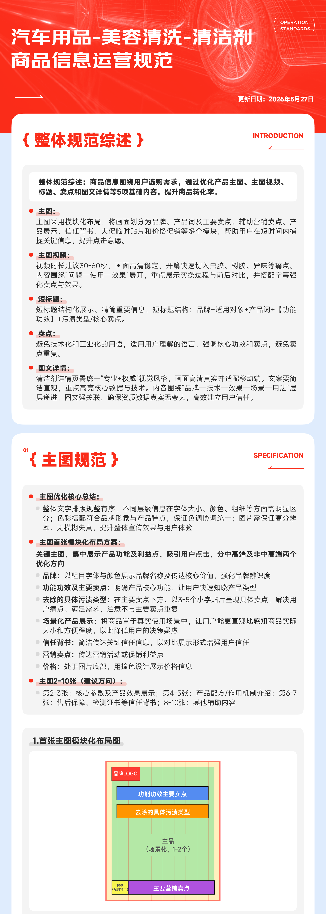

来源：<https://img30.360buyimg.com/popXue/jfs/t1/441857/31/8543/1115759/6a1d9283F7a960d01/012b78000089110f.dpg>

### 图片 8

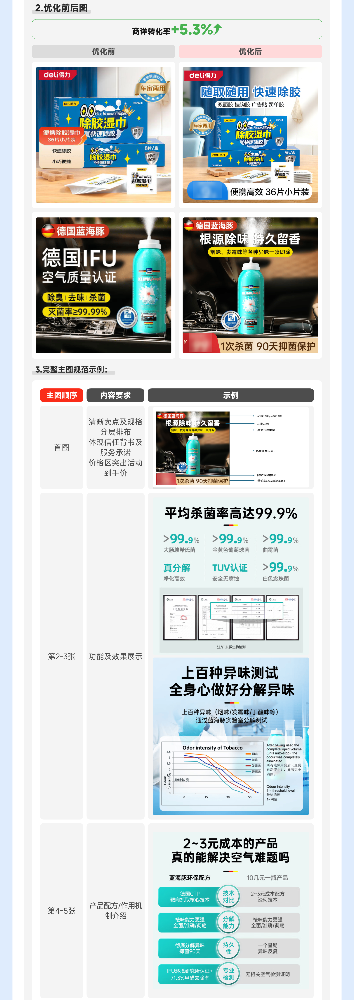

来源：<https://img30.360buyimg.com/popXue/jfs/t1/443400/39/10115/4607002/6a1d9298Fcec2a409/012b780000b7fdad.dpg>

### 图片 9

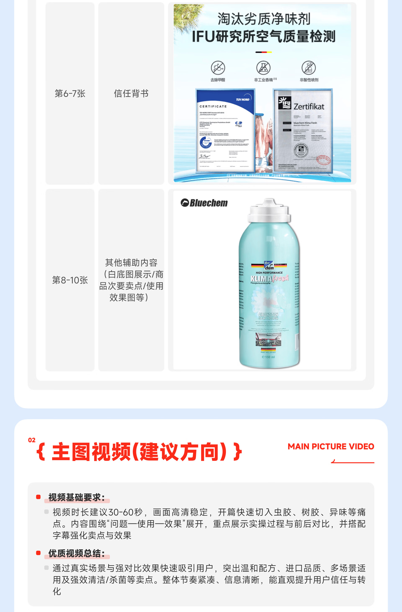

来源：<https://img30.360buyimg.com/popXue/jfs/t1/442652/19/9878/247502/6a1d92adFa5477440/012b780b66604155.dpg>

### 图片 10

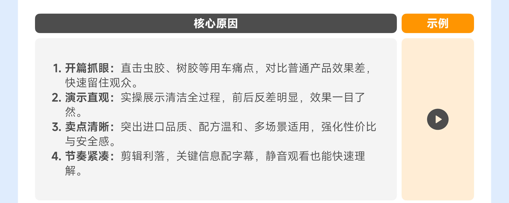

来源：<https://img30.360buyimg.com/popXue/jfs/t1/443834/11/10514/90254/6a1d92b8F6a443a5b/012b780300d441dd.dpg>

### 图片 11

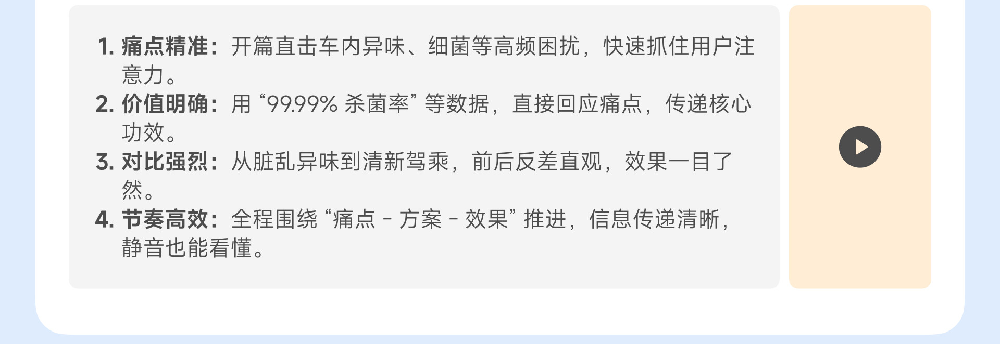

来源：<https://img30.360buyimg.com/popXue/jfs/t1/441528/20/9976/84804/6a1d92e3Fbdc8346f/012b780296b8cd6d.dpg>

### 图片 12

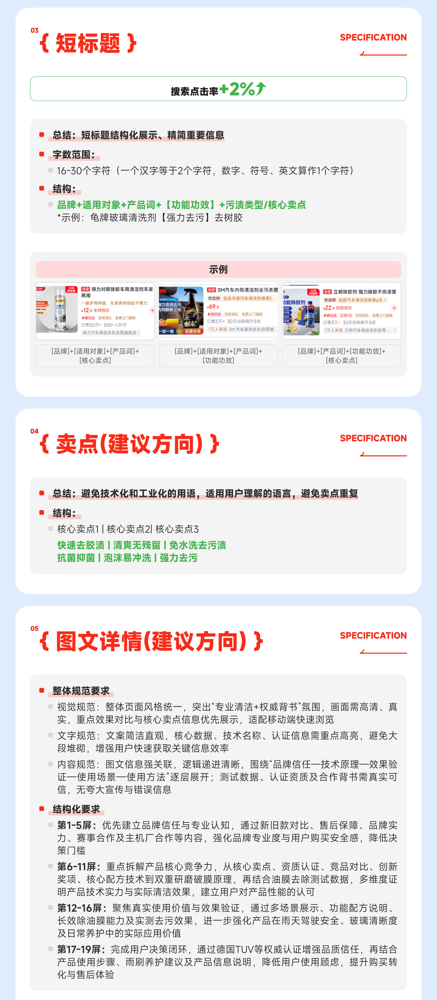

来源：<https://img30.360buyimg.com/popXue/jfs/t1/449392/9/6846/908963/6a266bdfF3d581b12/012b78000095bbf2.dpg>

### 图片 13


来源：<https://img30.360buyimg.com/popXue/jfs/t1/445201/31/7261/2958871/6a1d9316F5dbc3b40/012b78000039dbf9.dpg>

### 图片 14

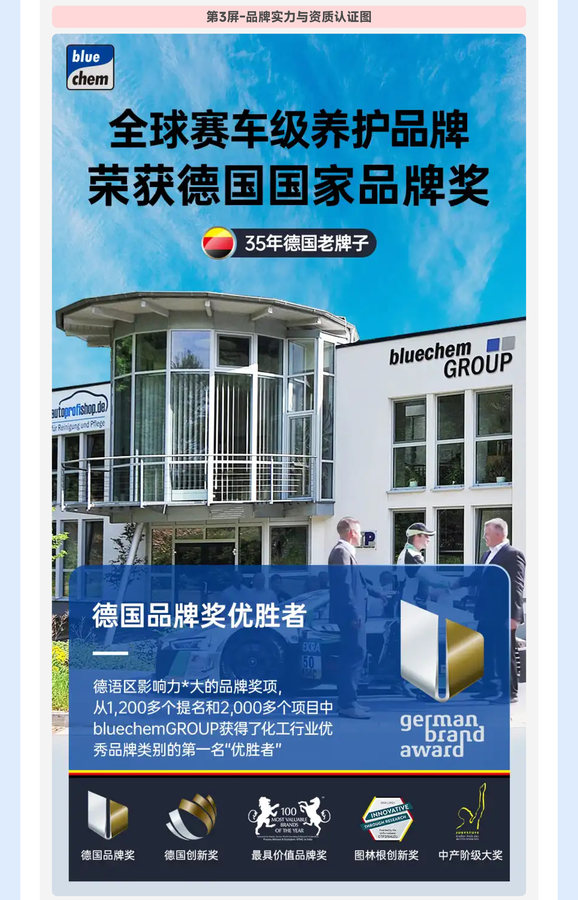

来源：<https://img30.360buyimg.com/popXue/jfs/t1/449934/23/159/3480867/6a1d931fF4652f3d6/012b780ba6b27a9c.dpg>

### 图片 15

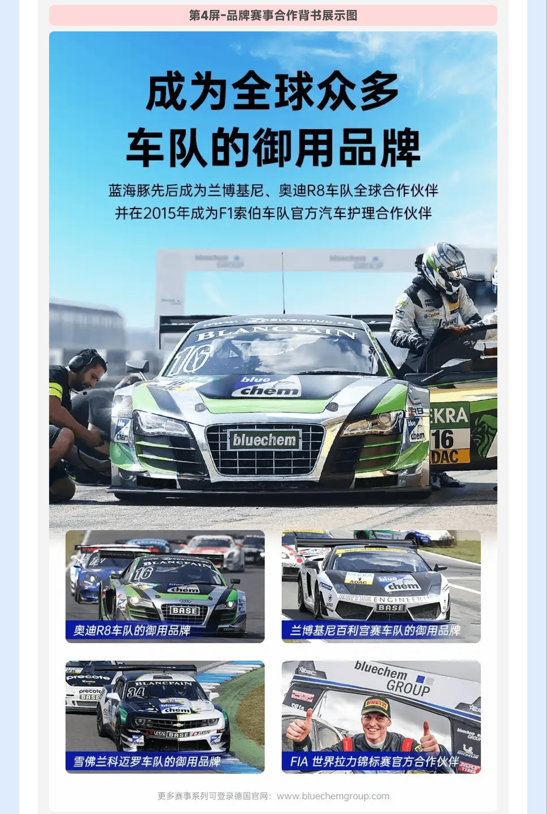

来源：<https://img30.360buyimg.com/popXue/jfs/t1/444028/33/10336/4394389/6a1d932aF88f362aa/012b782b2b47b2b7.dpg>

### 图片 16

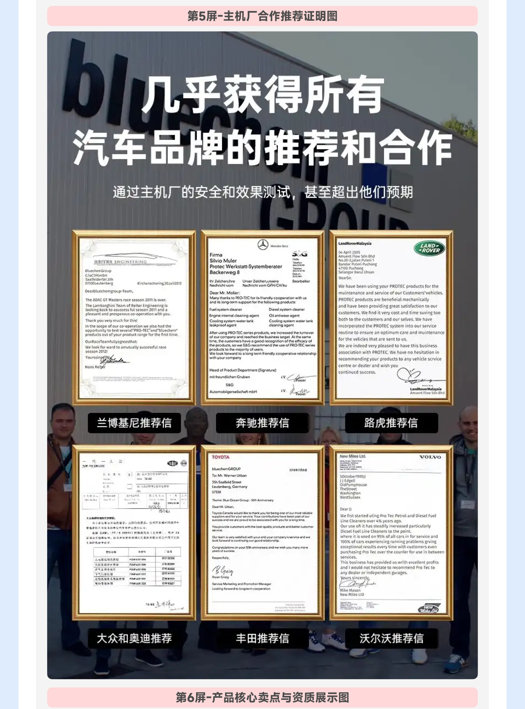

来源：<https://img30.360buyimg.com/popXue/jfs/t1/441779/30/14266/2499759/6a1d9334F58da27ad/012b780a1d44c9fd.dpg>

### 图片 17

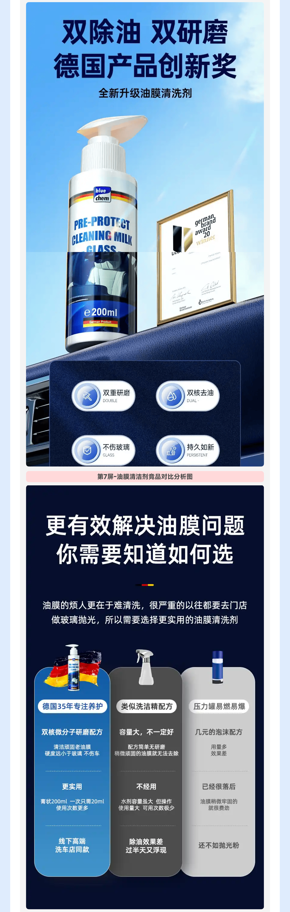

来源：<https://img30.360buyimg.com/popXue/jfs/t1/449183/35/707/5256744/6a1d933eFffd94361/012b78000099a24a.dpg>

### 图片 18

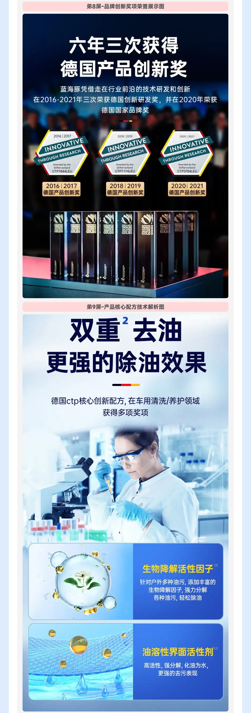

来源：<https://img30.360buyimg.com/popXue/jfs/t1/443529/31/9982/5299956/6a1d9347F8e73cfae/012b7800001abfb8.dpg>

### 图片 19

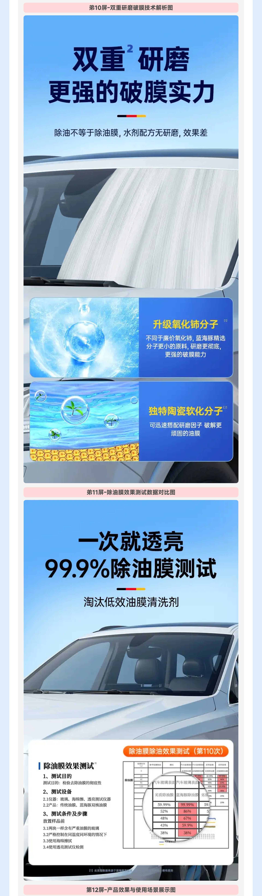

来源：<https://img30.360buyimg.com/popXue/jfs/t1/443168/35/10903/5349171/6a1d9351Fca2de69c/012b780000e0a71a.dpg>

### 图片 20


来源：<https://img30.360buyimg.com/popXue/jfs/t1/448233/4/1010/2305249/6a1d935cF5c991ed1/012b780c27d03c64.dpg>

### 图片 21

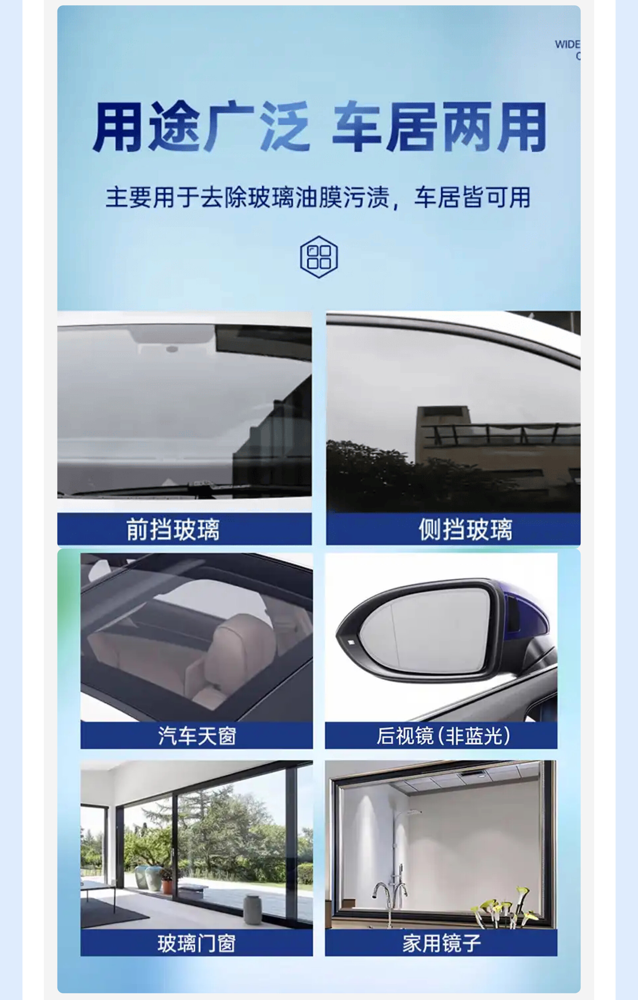

来源：<https://img30.360buyimg.com/popXue/jfs/t1/444364/21/9253/2275527/6a1d9367Fd904e40a/012b780bc06fe97e.dpg>

### 图片 22

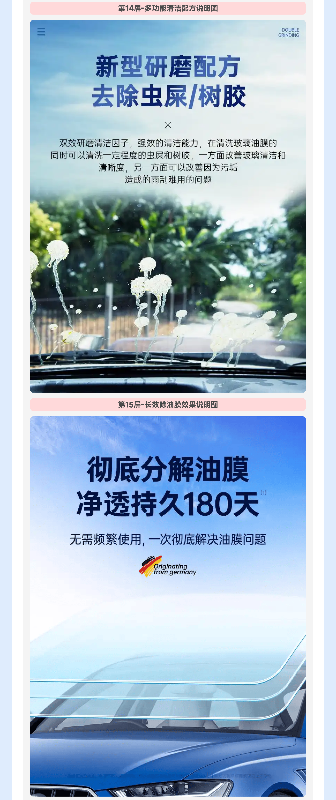

来源：<https://img30.360buyimg.com/popXue/jfs/t1/445864/8/7150/4489619/6a1d9370Ff3f3c54d/012b780000108f73.dpg>

### 图片 23

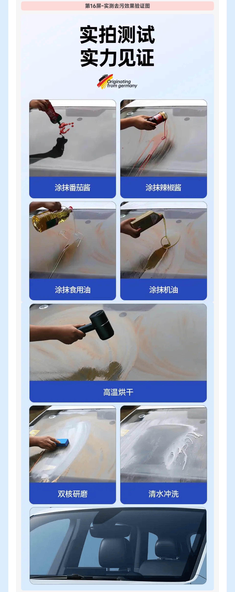

来源：<https://img30.360buyimg.com/popXue/jfs/t1/446179/14/8533/3694748/6a1d937aFc9b56bcc/012b7800006835b4.dpg>

### 图片 24

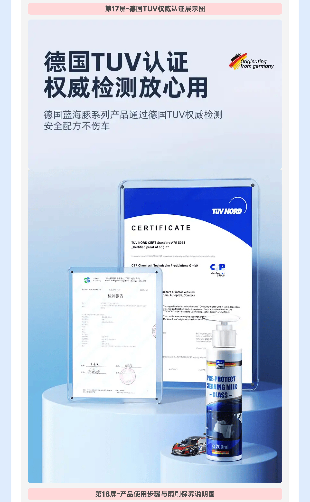

来源：<https://img30.360buyimg.com/popXue/jfs/t1/445542/1/7904/1951206/6a1d938bFb6e596b4/012b780c242b47ec.dpg>

### 图片 25

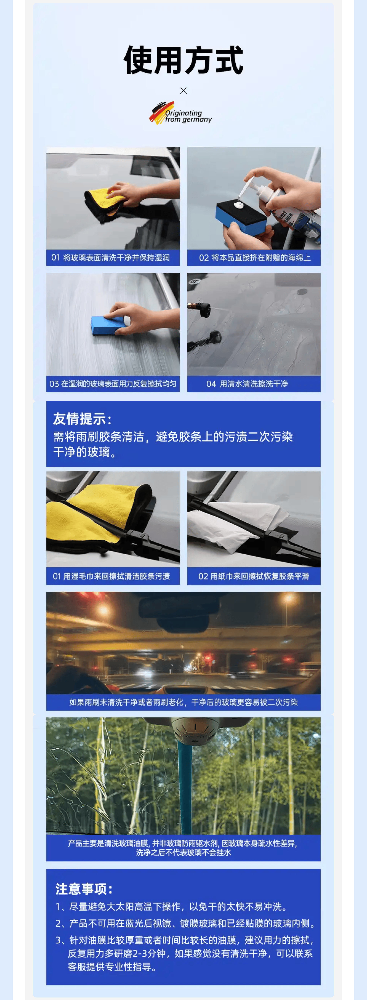

来源：<https://img30.360buyimg.com/popXue/jfs/t1/449623/19/377/5102455/6a1d9398F667c75eb/012b78000002ad11.dpg>

### 图片 26

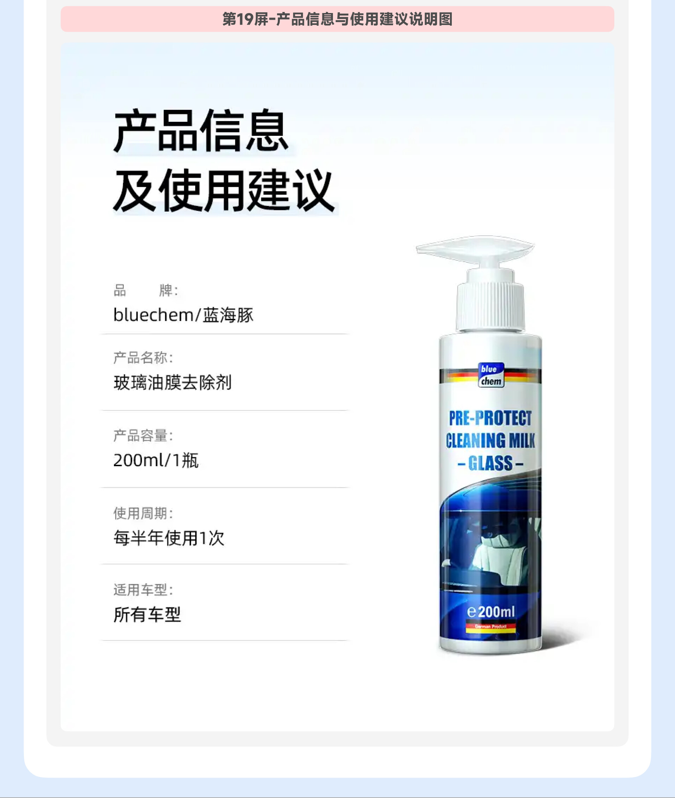

来源：<https://img30.360buyimg.com/popXue/jfs/t1/445510/2/8535/660261/6a1d93a3Fb255b805/012b7808dce56d4f.dpg>

### 图片 27


来源：<https://img10.360buyimg.com/imagetools/jfs/t1/162130/26/24232/286570/619e26e7Eac9895d1/d34af86cbd6fd6e6.png>

### 图片 28


来源：<https://storage.jd.com/op-jm-man.jd.com/servicenoIcon/6715.298120766556_LOGOJPG>

### 图片 29


来源：<https://storage.360buyimg.com/shop-pageframe/mtt.jd.com/prod/1.0.27-master.f16f8d5/mttheader/74dac3ca1602de0e6be4380041c105e1.svg>

### 图片 30


来源：<https://mtt.jd.com/article/articleView/aeced16c-9413-4b3d-b333-6d3a3120b532.action>

### 图片 31


来源：<https://mtt.jd.com/article/articleView/aeced16c-9413-4b3d-b333-6d3a3120b532.action>

### 图片 32


来源：<https://mtt.jd.com/article/articleView/aeced16c-9413-4b3d-b333-6d3a3120b532.action>

图片 33：未下载；响应不是可识别图片，可能登录/失效页。请查看 page.jpg 或原页。


## 表格和链接

页面识别到 0 个 HTML 表格，合并单元格信息保存在 structure.json；顺序及静态结构见 page.html。

若规则本身在图片里，只读本文件的文字不等于已读完规范。
